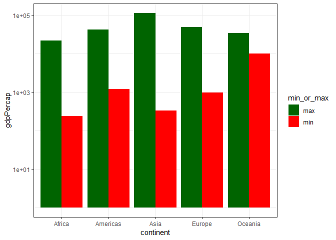
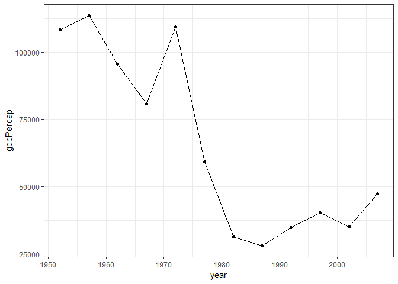

gapminder\_hw03
================

Homework 03: Use dplyr/ggplot2 to manipulate and explore data
=============================================================

Load packages

``` r
suppressPackageStartupMessages(library(tidyverse))
suppressPackageStartupMessages(library(gapminder))
```

I selected some of the suggested tasks, as well as made up some of my own.

Max/Min GDP per capita for all continents
-----------------------------------------

Task 1: Get the maximum and minimum of GDP per capita for all continents.

``` r
min_max <- gapminder %>%
  group_by(continent) %>%
  summarise(min = min(gdpPercap),
            max = max(gdpPercap))

min_max %>%
  knitr::kable()
```

| continent |         min|        max|
|:----------|-----------:|----------:|
| Africa    |    241.1659|   21951.21|
| Americas  |   1201.6372|   42951.65|
| Asia      |    331.0000|  113523.13|
| Europe    |    973.5332|   49357.19|
| Oceania   |  10039.5956|   34435.37|

Here are the minimum and maximum GDP per capita for all continents.

But I also want to find out what countries these belong to?

``` r
min_max <- min_max %>%
  gather(key = min_or_max, value = "gdpPercap", min, max)

inner_join(min_max, gapminder, by = c("continent", "gdpPercap")) %>%
  select(1:4) %>%
  knitr::kable()
```

| continent | min\_or\_max |    gdpPercap| country                |
|:----------|:-------------|------------:|:-----------------------|
| Africa    | min          |     241.1659| Congo, Dem. Rep.       |
| Americas  | min          |    1201.6372| Haiti                  |
| Asia      | min          |     331.0000| Myanmar                |
| Europe    | min          |     973.5332| Bosnia and Herzegovina |
| Oceania   | min          |   10039.5956| Australia              |
| Africa    | max          |   21951.2118| Libya                  |
| Americas  | max          |   42951.6531| United States          |
| Asia      | max          |  113523.1329| Kuwait                 |
| Europe    | max          |   49357.1902| Norway                 |
| Oceania   | max          |   34435.3674| Australia              |

I used `gather` on the data and then `inner_join`. I can know see for each continent's min and max, what country that corresponds with.

``` r
min_max %>%
  ggplot(aes(x = continent, y = gdpPercap)) +
  geom_bar(aes(fill = min_or_max), stat="identity", position = position_dodge()) +
  scale_fill_manual(values = c("min" = "red", "max" = "darkgreen")) +
  theme_bw()
```


As a visual, we can see the min and max GDP per capita for each continent. The disparity is greatest in Asia annd lowest iin Oceania.

``` r
min_max %>%
  ggplot(aes(x = continent, y = gdpPercap)) +
  geom_bar(aes(fill = min_or_max), stat="identity", position = position_dodge()) +
  scale_fill_manual(values = c("min" = "red", "max" = "darkgreen")) +
  theme_bw() +
  scale_y_log10()
```



The same plot with a log y scale to better see the differences.

Spread of GDP per capita
------------------------

Task 2: Look at the spread of GDP per capita within the continents.

``` r
gapminder %>%
  group_by(continent) %>%
  summarise(variance = var(gdpPercap),
            std_dev = sd(gdpPercap)) %>%
  knitr::kable()
```

| continent |   variance|   std\_dev|
|:----------|----------:|----------:|
| Africa    |    7997187|   2827.930|
| Americas  |   40918591|   6396.764|
| Asia      |  197272506|  14045.373|
| Europe    |   87520020|   9355.213|
| Oceania   |   40436669|   6358.983|

Here, I've taken a look at spread by looking at variance and standard deviation. Like above, with the min/max, we can see the greatest variance in Asia. This highlights wealth inequality between the countries in Asia.

``` r
gapminder %>%
  group_by(continent) %>%
  summarise(variance = var(gdpPercap),
            std_dev = sd(gdpPercap)) %>%
  ggplot(aes(x = reorder(continent, std_dev), y = std_dev)) +
  geom_bar(aes(fill = continent), stat="identity", show.legend = FALSE) +
  theme_bw()
```


Here is the standard deviation plotted as a bar plot. The x-axis is ordered by std\_dev value. We can see that SD is lowest for African countries. However, does it make sense to look at SD? Are the values normally distributed?

``` r
ggplot(gapminder, aes(x = continent, y = gdpPercap)) +
  scale_y_log10() +
  theme_bw() +
  geom_violin(aes(fill = continent), show.legend = FALSE) +
  geom_jitter(alpha = 0.2)
```


Here, I overlaid a fitter and violin plot. We can see that while the SD for African countries is low, there is a skew to high values. In fact Oceania has the tighest spread between its wealthiest and poorest countries.

Life Expectancy over time in each continent
-------------------------------------------

Task 3: How is life expectancy changing over time on different continents?

``` r
gapminder %>%
  ggplot(aes(x = year, y = lifeExp, color = country)) +
  geom_line(lwd = 0.5, show.legend = FALSE) + 
  facet_wrap(~ continent) +
  theme_bw()
```


Here, I plot the lifeExp of each country as a different colour of the years. Over time, life expenctancy increases, in general, for most countries and all continents. Additional things I did were to hide the legend, change the line width, change to bw theme, and facet by the different continents.

``` r
gapminder %>%
  ggplot(aes(x = year, y = lifeExp)) +
  geom_point() +
  facet_wrap(~ continent) +
  geom_smooth(method = "lm") +
  theme_bw()
```


To see trends for each continent, instead of lines for each country, I plotted things differently here. We have points for each country and a linear trend line added with `geom_smooth`. Now we can clearly see that for each continent, life expentancy increases over time.

Mean vs Weighted mean Life Expectancy over time
-----------------------------------------------

Task 4: calculate the world-wide mean life expectancy (normal and weighted) over time

This is the mean life expectancy over time.

``` r
mean_lifeExp <- gapminder %>%
  group_by(year) %>%
  summarise(mean = mean(lifeExp))

mean_lifeExp %>%
  knitr::kable()
```

|  year|      mean|
|-----:|---------:|
|  1952|  49.05762|
|  1957|  51.50740|
|  1962|  53.60925|
|  1967|  55.67829|
|  1972|  57.64739|
|  1977|  59.57016|
|  1982|  61.53320|
|  1987|  63.21261|
|  1992|  64.16034|
|  1997|  65.01468|
|  2002|  65.69492|
|  2007|  67.00742|

This is the weighted mean by population.

``` r
w_mean_lifeExp <- gapminder %>%
  group_by(year) %>%
  summarise(w_mean = weighted.mean(lifeExp, pop))

w_mean_lifeExp %>%
  knitr::kable()
```

|  year|   w\_mean|
|-----:|---------:|
|  1952|  48.94424|
|  1957|  52.12189|
|  1962|  52.32438|
|  1967|  56.98431|
|  1972|  59.51478|
|  1977|  61.23726|
|  1982|  62.88176|
|  1987|  64.41635|
|  1992|  65.64590|
|  1997|  66.84934|
|  2002|  67.83904|
|  2007|  68.91909|

We can compare the difference between the mean and weighted mean by population.

``` r
inner_join(mean_lifeExp, w_mean_lifeExp, by = "year") %>%
  mutate(difference = mean - w_mean)%>%
  knitr::kable()
```

|  year|      mean|   w\_mean|  difference|
|-----:|---------:|---------:|-----------:|
|  1952|  49.05762|  48.94424|    0.113383|
|  1957|  51.50740|  52.12189|   -0.614484|
|  1962|  53.60925|  52.32438|    1.284867|
|  1967|  55.67829|  56.98431|   -1.306017|
|  1972|  57.64739|  59.51478|   -1.867396|
|  1977|  59.57016|  61.23726|   -1.667099|
|  1982|  61.53320|  62.88176|   -1.348558|
|  1987|  63.21261|  64.41635|   -1.203737|
|  1992|  64.16034|  65.64590|   -1.485562|
|  1997|  65.01468|  66.84934|   -1.834667|
|  2002|  65.69492|  67.83904|   -2.144119|
|  2007|  67.00742|  68.91909|   -1.911670|

I used `inner_join` and `mutate` to do so. We can also see that generally, the mean is lower than the weighted mean.

We can plot both the mean and weighted mean over time.

``` r
join_means <- inner_join(mean_lifeExp, w_mean_lifeExp, by = "year") %>%
  gather(key = mean_type, value = mean, mean, w_mean) %>%
  mutate(mean_type = if_else(mean_type == "w_mean", "weighted mean by pop", mean_type))

join_means %>%
  knitr::kable()
```

|  year| mean\_type           |      mean|
|-----:|:---------------------|---------:|
|  1952| mean                 |  49.05762|
|  1957| mean                 |  51.50740|
|  1962| mean                 |  53.60925|
|  1967| mean                 |  55.67829|
|  1972| mean                 |  57.64739|
|  1977| mean                 |  59.57016|
|  1982| mean                 |  61.53320|
|  1987| mean                 |  63.21261|
|  1992| mean                 |  64.16034|
|  1997| mean                 |  65.01468|
|  2002| mean                 |  65.69492|
|  2007| mean                 |  67.00742|
|  1952| weighted mean by pop |  48.94424|
|  1957| weighted mean by pop |  52.12189|
|  1962| weighted mean by pop |  52.32438|
|  1967| weighted mean by pop |  56.98431|
|  1972| weighted mean by pop |  59.51478|
|  1977| weighted mean by pop |  61.23726|
|  1982| weighted mean by pop |  62.88176|
|  1987| weighted mean by pop |  64.41635|
|  1992| weighted mean by pop |  65.64590|
|  1997| weighted mean by pop |  66.84934|
|  2002| weighted mean by pop |  67.83904|
|  2007| weighted mean by pop |  68.91909|

``` r
join_means %>%
  ggplot(aes(x = year, y = mean, colour = mean_type)) +
  geom_point() +
  geom_line() +
  theme_bw()
```


Here, I've made use of `inner_join` and `gather` to change the data frame. Then I used `mutate` and `if_else` (to rename "w\_mean" to "weighted mean by pop"). I finally plot and see that both means increase over time (using geom\_point and geom\_line).

Biggest drop and gain in GDP per capita
---------------------------------------

Task 5: Find out which country has biggest gain and biggest drop in GDP per capita over a 5 year period for each continent.

First calculate the change each 5 years.

``` r
change <- gapminder %>%
  group_by(country) %>%
  mutate(change = gdpPercap - lag(gdpPercap)) 

change %>%
  head(20) %>%
  knitr::kable()
```

| country     | continent |  year|  lifeExp|       pop|  gdpPercap|      change|
|:------------|:----------|-----:|--------:|---------:|----------:|-----------:|
| Afghanistan | Asia      |  1952|   28.801|   8425333|   779.4453|          NA|
| Afghanistan | Asia      |  1957|   30.332|   9240934|   820.8530|    41.40772|
| Afghanistan | Asia      |  1962|   31.997|  10267083|   853.1007|    32.24768|
| Afghanistan | Asia      |  1967|   34.020|  11537966|   836.1971|   -16.90357|
| Afghanistan | Asia      |  1972|   36.088|  13079460|   739.9811|   -96.21603|
| Afghanistan | Asia      |  1977|   38.438|  14880372|   786.1134|    46.13225|
| Afghanistan | Asia      |  1982|   39.854|  12881816|   978.0114|   191.89808|
| Afghanistan | Asia      |  1987|   40.822|  13867957|   852.3959|  -125.61549|
| Afghanistan | Asia      |  1992|   41.674|  16317921|   649.3414|  -203.05455|
| Afghanistan | Asia      |  1997|   41.763|  22227415|   635.3414|   -14.00004|
| Afghanistan | Asia      |  2002|   42.129|  25268405|   726.7341|    91.39270|
| Afghanistan | Asia      |  2007|   43.828|  31889923|   974.5803|   247.84628|
| Albania     | Europe    |  1952|   55.230|   1282697|  1601.0561|          NA|
| Albania     | Europe    |  1957|   59.280|   1476505|  1942.2842|   341.22811|
| Albania     | Europe    |  1962|   64.820|   1728137|  2312.8890|   370.60471|
| Albania     | Europe    |  1967|   66.220|   1984060|  2760.1969|   447.30797|
| Albania     | Europe    |  1972|   67.690|   2263554|  3313.4222|   553.22526|
| Albania     | Europe    |  1977|   68.930|   2509048|  3533.0039|   219.58172|
| Albania     | Europe    |  1982|   70.420|   2780097|  3630.8807|    97.87681|
| Albania     | Europe    |  1987|   72.000|   3075321|  3738.9327|   108.05201|

Next, group by continent and find the min and max

``` r
min_max <- change %>%
  filter(!is.na(change)) %>%
  group_by(continent) %>%
  summarise(max = max(change),
            min = min(change))

min_max %>%
  knitr::kable()
```

| continent |        max|          min|
|:----------|----------:|------------:|
| Africa    |  12015.721|   -6632.2113|
| Americas  |   6547.909|   -2169.6412|
| Asia      |  28452.984|  -50082.3899|
| Europe    |   9555.102|   -6545.8103|
| Oceania   |   3747.613|    -643.8664|

After, `gather` and `inner_join` to figure out the country that the changes belonged to.

``` r
min_max_country <- gather(min_max, key = min_max, value = change, max, min) %>%
  inner_join(change, by = c("continent", "change")) %>%
  select(1:4) 

min_max_country %>%
  knitr::kable()
```

| continent | min\_max |       change| country             |
|:----------|:---------|------------:|:--------------------|
| Africa    | max      |   12015.7209| Libya               |
| Americas  | max      |    6547.9090| Trinidad and Tobago |
| Asia      | max      |   28452.9837| Kuwait              |
| Europe    | max      |    9555.1023| Ireland             |
| Oceania   | max      |    3747.6127| Australia           |
| Africa    | min      |   -6632.2113| Gabon               |
| Americas  | min      |   -2169.6412| Argentina           |
| Asia      | min      |  -50082.3899| Kuwait              |
| Europe    | min      |   -6545.8103| Serbia              |
| Oceania   | min      |    -643.8664| New Zealand         |

Plot of these changes in GDP per capita

``` r
min_max_country %>%
  ggplot(aes(x = country, y = change)) +
  geom_bar(aes(fill = min_max), stat="identity") +
  scale_fill_manual(values = c("min" = "red", "max" = "darkgreen")) +
  theme_bw() + 
  facet_wrap(~ continent, scales = "free") +
  coord_flip()
```


Here, I've plotted the min and max change in GDP per capita in the 5 year period for each continent and labeled what country experienced that change. I facet the plot by continent and also implement a `coord_flip` since the country names are long. Something I discovered is that Kuwait was the country in Asia that possessed both the max gain and loss in GDP per capita in a 5 year period. Let's plot Kuwait.

``` r
gapminder %>%
  filter(country == "Kuwait") %>%
  ggplot(aes(x = year, y = gdpPercap)) +
  geom_point() +
  geom_line() +
  theme_bw()
```



By plotting this out, we can see that Kuwait is a country that experienced quite a boom and bust in its economic wealth. This occured in the late 60's and 70's.
