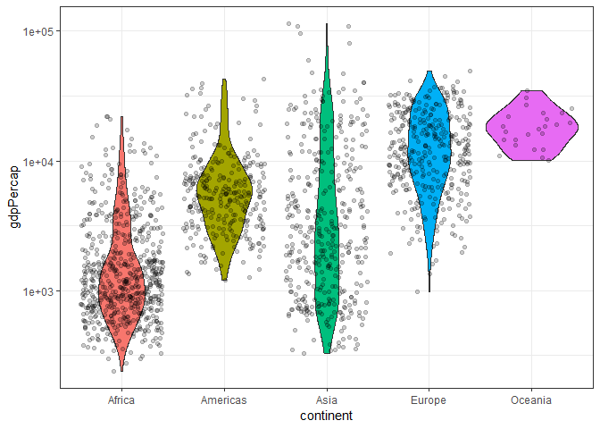

gapminder\_hw03
================

Homework 03: Use dplyr/ggplot2 to manipulate and explore data
=============================================================

Load packages

``` r
suppressPackageStartupMessages(library(tidyverse))
suppressPackageStartupMessages(library(gapminder))
```

Max/Min GDP per capita for all continents
-----------------------------------------

Task 1: Get the maximum and minimum of GDP per capita for all continents.

``` r
min_max <- gapminder %>%
  group_by(continent) %>%
  summarise(min = min(gdpPercap),
            max = max(gdpPercap))

min_max %>%
  knitr::kable()
```

| continent |         min|        max|
|:----------|-----------:|----------:|
| Africa    |    241.1659|   21951.21|
| Americas  |   1201.6372|   42951.65|
| Asia      |    331.0000|  113523.13|
| Europe    |    973.5332|   49357.19|
| Oceania   |  10039.5956|   34435.37|

Here are the minimum and maximum GDP per capita for all continents.

But I also want to find out what countries these belong to?

``` r
min_max <- min_max %>%
  gather(key = min_or_max, value = "gdpPercap", min, max)

inner_join(min_max, gapminder, by = c("continent", "gdpPercap")) %>%
  select(1:4) %>%
  knitr::kable()
```

| continent | min\_or\_max |    gdpPercap| country                |
|:----------|:-------------|------------:|:-----------------------|
| Africa    | min          |     241.1659| Congo, Dem. Rep.       |
| Americas  | min          |    1201.6372| Haiti                  |
| Asia      | min          |     331.0000| Myanmar                |
| Europe    | min          |     973.5332| Bosnia and Herzegovina |
| Oceania   | min          |   10039.5956| Australia              |
| Africa    | max          |   21951.2118| Libya                  |
| Americas  | max          |   42951.6531| United States          |
| Asia      | max          |  113523.1329| Kuwait                 |
| Europe    | max          |   49357.1902| Norway                 |
| Oceania   | max          |   34435.3674| Australia              |

I used `gather` on the data and then `inner_join`. I can know see for each continent's min and max, what country that corresponds with.

``` r
min_max %>%
  ggplot(aes(x = continent, y = gdpPercap)) +
  geom_bar(aes(fill = min_or_max), stat="identity", position = position_dodge()) +
  scale_fill_manual(values = c("min" = "red", "max" = "darkgreen")) +
  theme_bw()
```


As a visual, we can see the min and max GDP per capita for each continent. The disparity is greatest in Asia annd lowest iin Oceania.

``` r
min_max %>%
  ggplot(aes(x = continent, y = gdpPercap)) +
  geom_bar(aes(fill = min_or_max), stat="identity", position = position_dodge()) +
  scale_fill_manual(values = c("min" = "red", "max" = "darkgreen")) +
  theme_bw() +
  scale_y_log10()
```


The same plot with a log y scale to better see the differences.

Spread of GDP per capita
------------------------

Task 2: Look at the spread of GDP per capita within the continents.

``` r
gapminder %>%
  group_by(continent) %>%
  summarise(variance = var(gdpPercap),
            std_dev = sd(gdpPercap)) %>%
  knitr::kable()
```

| continent |   variance|   std\_dev|
|:----------|----------:|----------:|
| Africa    |    7997187|   2827.930|
| Americas  |   40918591|   6396.764|
| Asia      |  197272506|  14045.373|
| Europe    |   87520020|   9355.213|
| Oceania   |   40436669|   6358.983|

Here, I've taken a look at spread by looking at variance and standard deviation. Like above, with the min/max, we can see the greatest variance in Asia. This highlights wealth inequality between the countries in Asia.

``` r
gapminder %>%
  group_by(continent) %>%
  summarise(variance = var(gdpPercap),
            std_dev = sd(gdpPercap)) %>%
  ggplot(aes(x = reorder(continent, std_dev), y = std_dev)) +
  geom_bar(aes(fill = continent), stat="identity", show.legend = FALSE) +
  theme_bw()
```


Here is the standard deviation plotted as a bar plot. The x-axis is ordered by std\_dev value. We can see that SD is lowest for African countries. However, does it make sense to look at SD? Are the values normally distributed?

``` r
ggplot(gapminder, aes(x = continent, y = gdpPercap)) +
  scale_y_log10() +
  theme_bw() +
  geom_violin(aes(fill = continent), show.legend = FALSE) +
  geom_jitter(alpha = 0.2)
```



Here, I overlaid a fitter and violin plot. We can see that while the SD for African countries is low, there is a skew to high values. In fact Oceania has the tighest spread between its wealthiest and poorest countries.

Life Expectancy over time
-------------------------

Task 3: How is life expectancy changing over time on different continents?

``` r
gapminder %>%
  ggplot(aes(x = year, y = lifeExp, color = country)) +
  geom_line(lwd = 0.5, show.legend = FALSE) + 
  facet_wrap(~ continent) +
  theme_bw()
```


Here, I plot the lifeExp of each country as a different colour of the years. Over time, life expenctancy increases, in general, for most countries and all continents. Additional things I did were to hide the legend, change the line width, change to bw theme, and facet by the different continents.

``` r
gapminder %>%
  ggplot(aes(x = year, y = lifeExp)) +
  geom_point() +
  facet_wrap(~ continent) +
  geom_smooth(method = "lm") +
  theme_bw()
```


To see trends for each continent, instead of lines for each country, I plotted things differently here. We have points for each country and a linear trend line added with `geom_smooth`. Now we can clearly see that for each continent, life expentancy increases over time.
